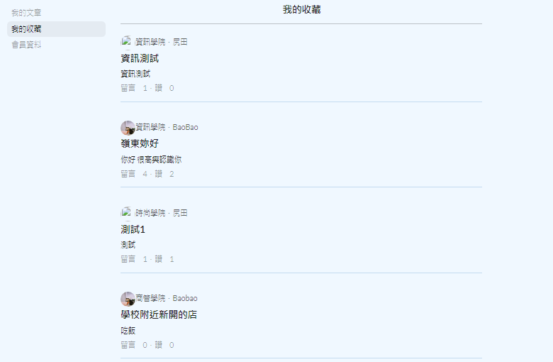

# Wanna Talk 網Talk 論壇網站

網站已完成上傳發布 [點此即可瀏覽](https://wanna-talk-e1162.web.app/).

## 使用技術
* ReactJS
* Node.js
* Google Firebase

## 開發動機
隨著現代社會年輕人總是會在論壇上面分享許多事情，讓大家都可以清楚地了解各分層的一些事情，畢竟每一個人都有不一樣的人生，透過論壇可將個人經歷分享給他人，讓也有相同經歷的人可以找尋同溫層的溫暖，也可以透過他人的回應來讓自己有歸屬感。

以現有公開的論壇網站中，例如：Dcard、PTT等，都有開發各自專版，所以以論壇為發想，建置嶺東科大師生能使用的網站，而這也是想完成屬於自己想做的主題。

本專題主要目的是應用互動技術來達成嶺東科技大學師生可多多交流所有各方面的相關資訊，可達成師生共享的環境。主要內容以論壇為主，頁面有放置各系的文章提供大家觀看，讓大家可以更加瞭解彼此科系的各項事務，以及如果需要轉學考或者是雙主修可以更加知曉。

### `論壇首頁`

首頁的部分展示出會員列表、主要選單、公告、活動展示。

### `會員登入/註冊`

登入頁面包含登入及註冊，依照使用者做使用。

### `會員文章發佈/收藏文章/會員資料`

進入會員介面可以查看曾發布過的文章、收藏的文章及自己的資料

### `所有文章列表`

使用者發佈文章後，會將全部顯示在此頁面。

### `發表文章`

可將選好的主題、圖片、內容、分類輸入好並發佈就可以在所有文章列表及各自學院看到

### `文章內頁`

文章列表中點選想看的內容，會將當初編輯的內容顯示出來。在下方可以點讚、收藏、留言

### `後端資料庫建置`

後端使用Node.js及Google Firebase建置，使用Firebase中的Firestor Database、Authentication、Storage、Hosting完成建置部屬

## 結論
第一次完成心目中想做的主題，投稿比賽也得到不錯成績，全部並不是我的功勞，而是其他組員一起獲得的。
如果可以再重新修改，想把介面重新設計，頁面、平面設計是我的弱項，所以呈現出來並不是那麼美觀，也想把功能再做得更完整、更豐富。
